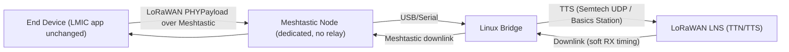

# LoRaWAN‑over‑Meshtastic (LWoM)

> **Updated direction (Dec 2025): Meshtastic Region Model**
> We map **LoRaWAN semantics** (registration, OTAA/ABP, end‑to‑end security, and Class A ordering) onto **Meshtastic** transport **without emulating the LoRa PHY** at the LMIC `radio()` layer. The LMIC high‑level API remains unchanged. We introduce runtime regions like **`MESHTASTIC_US915`** and **`MESHTASTIC_EU868`** whose constraints are defined by Meshtastic.

- **Preferred LNS**: **The Things Stack (TTS)** for The Things Network compatibility; **ChirpStack** may be used for local testing.
- **Payload cap**: Meshtastic `Data.payload` is **233 B**; we cap LoRaWAN **FRMPayload ≤ 220 B** (no FOpts) so total **PHYPayload ≤ 233 B**.
- **Timing**: **Soft RX windows** (e.g., RX1 delay **5–10 s**) rather than strict LoRa PHY 1 s/2 s.
- **ADR**: **Disabled** for Meshtastic regions.

---

## Quick links
- Overview: [`docs/lwom-overview.md`](docs/lwom-overview.md)
- Implementation: [`docs/lwom-implementation.md`](docs/lwom-implementation.md)
- Conversation summary: [`docs/conversation_summary.md`](docs/conversation_summary.md)
- Knowledge summary: [`docs/project_knowledge_summary.md`](docs/project_knowledge_summary.md)

---

## System diagram

---

## Why we changed direction
Strict PHY‑level emulation at the LMIC `radio()` interface produced **timing constraints** that are brittle and offer little value relative to the **LoRaWAN system model** we want (secure join, end‑to‑end encryption, Class A semantics). Meshtastic’s transport limits (not the LoRa PHY) now define our **runtime region** behavior, including **payload cap** and **soft RX timing**.

---

## References
- Meshtastic payload/structure: `Data.payload` **233 B** — `mesh.options` and message architecture.
- TTN/TTS US915 payload sizing and RX parameter controls.
- TTS gateway connectivity: Semtech UDP (legacy) and Basics Station (recommended).
