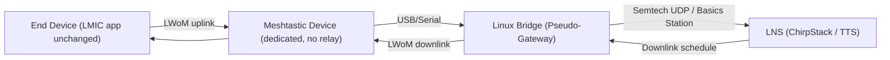
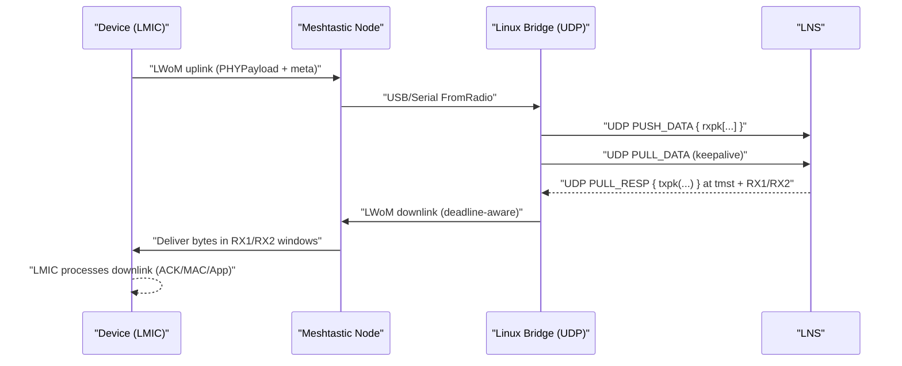
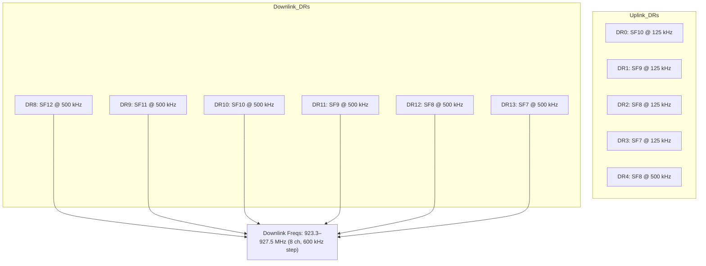

# LoRaWAN‑over‑Meshtastic (LWoM) — Overview

> **Purpose**  
> Tunnel **LoRaWAN Class A** traffic from devices using **LMIC** over **Meshtastic**, allowing devices out of gateway range to reach a LoRaWAN Network Server (**LNS**) **without changing the LMIC client API**. A dedicated Meshtastic node forwards frames to a Linux process that emulates a gateway (**Semtech UDP** first; **LoRa Basics Station** later).

---

## Background & Constraints

- **Class A** only; upper‑level firmware continues to use the **same LMIC API**.
- **Region**: initial focus on **US915 (US902–928 MHz)**.
- **Gateway emulation**: Start with **Semtech UDP**; optionally add **LoRa Basics Station** later.
- **Latency**: Expect mesh + USB + LNS latency; plan to **increase RX1 delay** via MAC for reliable downlinks.
- **ADR caveat**: ADR depends on real RF metrics and multi‑gateway diversity—our bridge has limited/synthetic metrics; start with ADR **disabled**.

---

## System Overview

**Flow summary**
1. The device’s LMIC radio HAL is **shimmed** to send LoRaWAN PHYPayloads inside Meshtastic `Data` messages.
2. A dedicated Meshtastic node forwards those frames via USB to the **Linux bridge**.
3. The bridge **emulates a gateway** (Semtech UDP first), forwards uplinks to the **LNS**, receives downlinks, and sends them back over Meshtastic in time for RX1/RX2.

---

## Component Responsibilities

### Device-side: LMIC–Meshtastic Radio Shim
- Sends **LoRaWAN PHYPayload** inside Meshtastic `Data` on a private port (`PORTNUM_LWOM`).
- Adds minimal metadata (DR string, frequency, coding rate, local TX timestamp hint).
- Arms **RX1/RX2** timers and injects downlink bytes to LMIC as if received by a radio.
- Keeps Meshtastic radio **mostly off**; **no relaying**; minimal hop limit.

### Dedicated Meshtastic Receiver
- Mains‑powered node connected via **USB/serial** to Linux.
- Forwards LWoM frames to the bridge; delivers downlinks to the device.

### Linux Bridge (Pseudo‑Gateway)
- **Semtech UDP** backend:
  - Sends `PUSH_DATA` with `rxpk` uplinks; maintains `PULL_DATA`; receives `PULL_RESP` (`txpk`) downlinks.
  - Downlink scheduler computes RX1/RX2 deadlines from uplink `tmst`.
- **Optionally** add **LoRa Basics Station** (LNS/CUPS) later for TLS and centralized channel plans.

---

## Timing & Latency Strategy

**Latency mitigations**
- Configure **RX1 delay** to **5 s** via MAC (RXTimingSetupReq / Join‑Accept parameter).
- Use **RX2** as fallback; ensure US915 downlink channel/DR mappings are correct.

---

## US915 Region Details

- **Default RX2**: 923.3 MHz, **DR8** (SF12@500 kHz).  
- Keep DR/channel mappings consistent across **LMIC shim**, **bridge**, and **LNS**.

---

## Known Limitations & Risks

- **ADR**: Without true SNR/RSSI and multi‑gateway diversity, ADR decisions are unreliable. Keep **disabled** initially or strictly constrained.
- **Gateway diversity/geolocation**: Single virtual gateway; features relying on multiple gateways are unavailable.
- **Precise concentrator timing**: No PPS/fine timestamps; Class B beaconing out of scope.
- **Regulatory mirroring**: LNS assumes real RF downlinks; ensure Meshtastic operation remains compliant on any RF path used.

---

## Security Considerations

- LoRaWAN **PHYPayload** remains **end‑to‑end encrypted** (device ↔ LNS); bridge and Meshtastic carry opaque bytes.
- Use a **dedicated Meshtastic channel key** and **private port** for LWoM to avoid cross‑talk and relaying.

---

## Roadmap / Next Steps

1. **Decisions**
   - LNS target: **ChirpStack** or **The Things Stack**.
   - **ADR**: keep **disabled** initially.
   - Acceptable **RX1 delay** (suggest **5 s** to start).
   - Backend: **Semtech UDP** first; **Basics Station** later.

2. **Deliverables**
   - `LwomFrame.proto` + nanopb generation.
   - LMIC radio shim (TX/RX, timers).
   - Linux UDP bridge (`rxpk` uplinks, `txpk` downlinks, scheduler, metrics).
   - Integration harness (Docker for LNS + tests).

3. **Later**
   - Add **Basics Station** backend (LNS/CUPS) for TLS and channel‑plan management.
   - Evaluate guarded ADR with synthetic metrics (optional).
