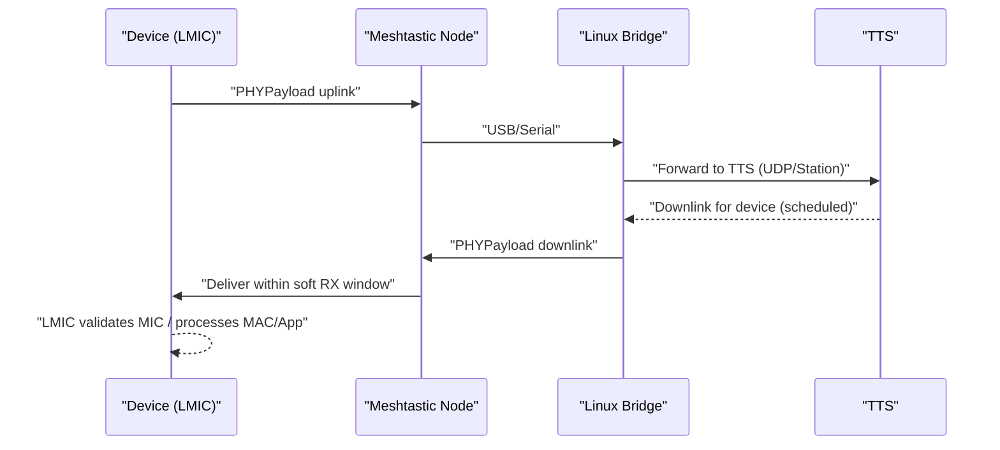

# LoRaWAN‑over‑Meshtastic (LWoM) — Implementation (Meshtastic Region Model)

This document specifies concrete interfaces, caps, timing, and tests for using Meshtastic as the transport while preserving **LoRaWAN system semantics**. TTS (TTN) is the preferred LNS; ChirpStack may be used for local testing.

---

## 1) Payload math and cap (final)

- Meshtastic `Data.payload` **max** = **233 B**.
  Source: [meshtastic/mesh.options](https://github.com/meshtastic/protobufs/blob/master/meshtastic/mesh.options)
- LoRaWAN **PHYPayload** = `MHDR + FHDR + FPort + FRMPayload + MIC`. For **no FOpts**: overhead **13 B**.
- **Cap decision**: `max FRMPayload = 220 B` (so `PHYPayload ≤ 233 B`). With **FOpts**, `max FRMPayload = 220 − FOptsLen`.
- LMIC Meshtastic regions **reject** app payloads that would exceed the cap **before** encoding.

---

## 2) LMIC runtime regions: `MESHTASTIC_US915`, `MESHTASTIC_EU868`, …

Each Meshtastic region provides:

- **`maxPHYPayloadLen = 233`** and derived **`maxAppPayloadLen = 220 − FOptsLen`**.
- **ADR disabled**.
- **Soft RX timing** (defaults): `rx1Delay = 5–10 s`, `rxGrace = +3–5 s`; accept downlinks delivered within this window.
- **No PHY knobs** (SF/BW/CR) exposed to LMIC; transport adapter handles Meshtastic messaging only.

Reference for US915 DR table/payload sizes (baseline LoRaWAN): [TTN US915](https://www.thethingsnetwork.org/docs/lorawan/regional-parameters/us915/).

---

## 3) Device-side transport adapter (no `radio()` emulation)

Minimal opaque interface to LMIC:

```c
// Send a LoRaWAN PHYPayload over Meshtastic transport.
bool meshtastic_transport_send(const uint8_t* phy, size_t phy_len);

// Register callback: delivers downlink PHYPayload bytes when available.
typedef void (*lmic_downlink_cb_t)(const uint8_t* phy, size_t phy_len);
void meshtastic_transport_on_downlink(lmic_downlink_cb_t cb);
```

Behavior:
- Reject `phy_len > 233`.
- Use a **private Meshtastic portnum** (range `256–511`) and a **dedicated channel key**.
  Source: [PortNum ranges](https://meshtastic.org/docs/development/firmware/portnum/)
- Set `want_ack=true` at Meshtastic level to improve reliability. (No relaying; minimal hop limit.)

---

## 4) Meshtastic wire usage

We carry **PHYPayload bytes** in `Data.payload` on our private portnum.

```text
Meshtastic Data:
  portnum       = PRIVATE_APP (e.g., 300)
  payload[0..n] = LoRaWAN PHYPayload (opaque)
  want_ack      = true
```

Reference: Meshtastic message model & payload limit: [Message Architecture](https://deepwiki.com/meshtastic/protobufs/2-message-architecture), [mesh.options](https://github.com/meshtastic/protobufs/blob/master/meshtastic/mesh.options).

---

## 5) Linux bridge → TTS

Start with **Semtech UDP** packet forwarder protocol, then migrate to **LoRa Basics Station** for production.

- **UDP path** (simple, widely supported):
  - Uplink: bridge forwards PHYPayload bytes to TTS; the LNS schedules replies; bridge sends downlink via Meshtastic during **soft RX**.
  - Reference: [TTS UDP guide](https://www.thethingsindustries.com/docs/hardware/gateways/concepts/udp/).

- **Basics Station** (recommended by TTS):
  - Secure TLS; central configuration via CUPS; better fleet ops.
  - Reference: [Basics Station docs](https://doc.sm.tc/station/).

> **Note:** We are not emulating SX130x concentrator timing. The bridge is a “transport shim” to TTS, and we configure longer RX1 delays via MAC.

---

## 6) Timing semantics (Class A, soft windows)



- Default **soft RX1**: **5–10 s**; **RX2** is fallback. We may patch TTS behavior if needed and propose upstream changes.

---

## 7) Testing & CI

### Unit
- **Payload cap**: app payloads near the boundary (219–221 B), with/without FOpts; LMIC rejects overflow.
- **Transport**: byte‑exact round‑trip of PHYPayload via adapter.

### Integration
- **OTAA/ABP** with **TTS**; deliver downlinks within soft RX window.
- **Confirmed uplinks** (ACK) validated with timing slack.

### HIL
- Real Meshtastic node; latency injection (transport + LNS); verify robustness.

---

## 8) Observability

- Counters: uplinks sent, downlinks received, soft‑window meet/miss, payload sizes rejected by cap.
- Latency histogram: device→bridge→TTS→bridge→device.

---

## 9) Security

- LoRaWAN **PHYPayload** stays **end‑to‑end encrypted** (device↔LNS).
- Meshtastic channel uses its own key; select a **private portnum**.

---

## 10) Deliverables

- LMIC: new regions `MESHTASTIC_*` with caps & soft RX; ADR disabled.
- Device: Meshtastic transport adapter.
- Bridge: UDP first; Station later; TTS integration scripts.
- CI: unit/integration/HIL harness.

---

## 11) References

- Meshtastic payload & structure:
  - `Data.payload` **233 B** and `MeshPacket.encrypted` notes: [mesh.options](https://github.com/meshtastic/protobufs/blob/master/meshtastic/mesh.options)
  - Message architecture (Data, MeshPacket): [DeepWiki](https://deepwiki.com/meshtastic/protobufs/2-message-architecture)
- LoRaWAN US915 payload sizing & DRs: [TTN US915](https://www.thethingsnetwork.org/docs/lorawan/regional-parameters/us915/)
- TTS gateway connectivity: [Semtech UDP in TTS](https://www.thethingsindustries.com/docs/hardware/gateways/concepts/udp/), [Basics Station](https://doc.sm.tc/station/)
- PortNum ranges: [Meshtastic PortNum](https://meshtastic.org/docs/development/firmware/portnum/)
