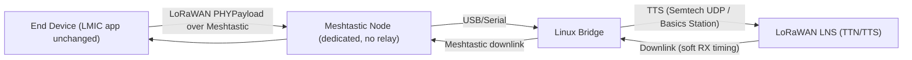
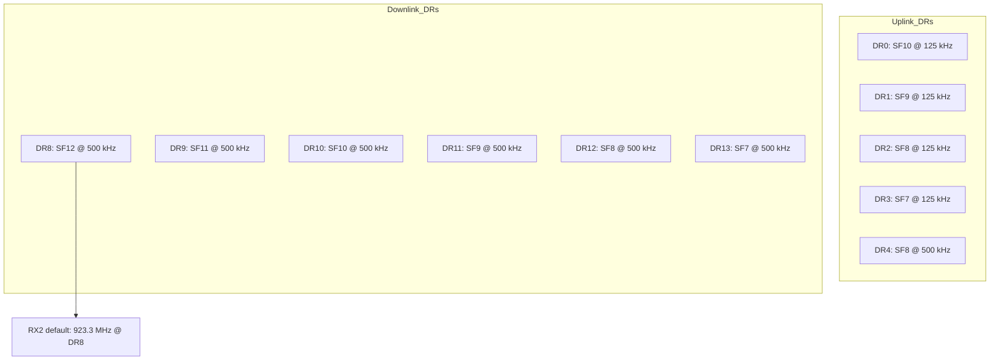

# LoRaWAN‑over‑Meshtastic (LWoM) — Overview (Meshtastic Region Model)

> **Purpose**
> Map **LoRaWAN’s system semantics** (device registration, OTAA/ABP, end‑to‑end security, and Class A “send → optional reply”) onto **Meshtastic** as the transport, **without emulating the LoRa PHY** at the LMIC `radio()` layer. The LMIC keeps its high‑level API unchanged, and we introduce runtime regions like **`MESHTASTIC_US915`** and **`MESHTASTIC_EU868`** whose constraints are defined by Meshtastic.

- **Preferred LNS**: **The Things Stack (TTS)** for TTN compatibility; **ChirpStack** is fine for local testing.
- **Transport limits**: Meshtastic `Data.payload` max **233 bytes**; we cap LoRaWAN **FRMPayload** at **220 bytes** (no FOpts) so the total **PHYPayload ≤ 233 bytes**.
  Sources: [Meshtastic mesh.options](https://github.com/meshtastic/protobufs/blob/master/meshtastic/mesh.options), [Message Architecture](https://deepwiki.com/meshtastic/protobufs/2-message-architecture), [TTN US915 payload sizes](https://www.thethingsnetwork.org/docs/lorawan/regional-parameters/us915/)
- **Timing**: Use **soft RX windows** (e.g., RX1 delay **5–10 s**) rather than LoRa PHY 1 s/2 s; deliver downlinks “soon after” uplinks. If a standard LNS is in the loop, configure longer RX1 delay via MAC (`RXTimingSetupReq`).
  Sources: [TTN US915](https://www.thethingsnetwork.org/docs/lorawan/regional-parameters/us915/), TTS UDP guidance [TTS docs](https://www.thethingsindustries.com/docs/hardware/gateways/concepts/udp/)
- **ADR**: **Disabled** for Meshtastic regions (avoid leaking PHY metrics up‑stack).

---

## System Overview

**Flow summary**
1. LMIC forms **PHYPayload** (OTAA/ABP, AppSKey/NwkSKey) and passes bytes to a **Meshtastic transport adapter** (not the radio HAL).
2. A dedicated Meshtastic node forwards frames via USB to the **Linux bridge**.
3. The bridge connects to **TTS** (preferred) using **Semtech UDP** or **Basics Station**; forwards uplinks; receives downlinks; returns bytes via Meshtastic within a **soft RX window**.

---

## Meshtastic Region Constraints (runtime)

- **Max PHYPayload**: **233 B** (Meshtastic `Data.payload`).
  → **Max FRMPayload** (no FOpts): **220 B**; with FOpts, `220 − FOptsLen`.
  Sources: [mesh.options (233 B Data payload)](https://github.com/meshtastic/protobufs/blob/master/meshtastic/mesh.options), [Message Architecture](https://deepwiki.com/meshtastic/protobufs/2-message-architecture)
- **Soft RX windows**: RX1 delay **5–10 s**, optional grace **+3–5 s**; RX2 used as fallback.
  Source: LoRaWAN allows RXTimingSetupReq; payload tables for US915: [TTN US915](https://www.thethingsnetwork.org/docs/lorawan/regional-parameters/us915/)
- **ADR**: **off** (no SNR/RSSI input from transport).
- **Portnum & channel**: use a **private portnum** (`256–511`) and a **dedicated Meshtastic channel/key**.
  Source: [Meshtastic PortNum ranges](https://meshtastic.org/docs/development/firmware/portnum/)

---

## US915 Snapshot (for TTN/TTS)

Source: [TTN US902–928](https://www.thethingsnetwork.org/docs/lorawan/regional-parameters/us915/)

---

## Known Limits & Choices

- **We do not emulate** LoRa PHY timing (1 s/2 s windows) or **ADR**. We preserve LoRaWAN semantics, security, and Class A ordering.
- **Payload cap**: 220 B app payload (no FOpts) to ensure `PHYPayload ≤ 233 B` (Meshtastic). Larger app payloads are rejected at the LMIC API.
- **Gateway diversity & geolocation** from multiple RF gateways are not applicable when using this transport; focus on E2E delivery.

---

## Roadmap / Next Steps

1. Define LMIC regions: `MESHTASTIC_US915`, `MESHTASTIC_EU868`, … with **caps and soft RX**.
2. Implement device **Meshtastic transport adapter** (send/receive PHYPayload bytes; no radio HAL emulation).
3. Bridge → **TTS** using **UDP** first; plan migration to **Basics Station**.
4. Tests: unit (payload cap), integration (OTAA/ACKs via TTS), HIL (real Meshtastic).
   Sources: [TTS UDP](https://www.thethingsindustries.com/docs/hardware/gateways/concepts/udp/), [Meshtastic protobufs](https://meshtastic.org/docs/development/reference/protobufs/)
